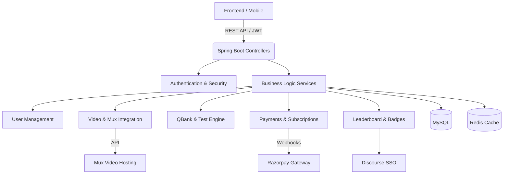

# PaceMaker Backend (Marrow-like Medical Learning Platform)

A comprehensive backend service built using Spring Boot 3.x for a medical learning platform similar to Marrow. This repository houses the REST APIs that support User Management, Video Streaming integration (via Mux), Live Classes (via Zoom), Question Banks, Exams, Analytics, and Payments (via Razorpay).

## Architecture Diagram



## Setup Instructions

### Prerequisites
- JDK 21
- MySQL Server 8+
- Redis (optional but recommended)
- Maven

### Installation & Run

1. **Clone the repository**
2. **Environment Variables**: Rename `.env.example` to `.env` and fill in your secrets.
3. **Run with Docker Compose** (Recommended):
   ```bash
   docker-compose up --build
   ```
4. **Run locally using Maven**:
   ```bash
   mvn clean install
   mvn spring-boot:run
   ```

### Features Implemented
- Day 1: Core Setup, JWT, PostgreSQL/MySQL, Flyway.
- Day 2: Mux Integration (Direct Upload, Video Metadata).
- Day 3: Live Class Entity (Zoom API).
- Day 4: QBank (Bulk Imports via CSV/JSON).
- Day 5: Test Engine (Exam creation, Attempt tracking).
- Day 6: Student Dashboard & Enrollments.
- Day 7: Video Comments.
- Day 8: Razorpay Payments & Subscriptions.
- Day 9: Study Material & File Uploads.
- Day 10: Global Exception Handling & Versioning.
- Day 11: Admin User Management.
- Day 12: Live Class Recordings.
- Day 13: Leaderboard API.
- Day 14: Community Forum (Discourse SSO).
- Day 15: Data Seeding / Docker Compose.
- Day 16: Performance Tuning (P6Spy, Indexes).
- Day 17: CSV Export APIs.

## CI/CD
GitHub Actions are configured to automatically build and test this project on any push or PR targeting the `main` branch.

## License
MIT License
